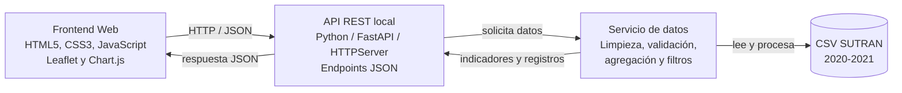

# SUTRAN VIAL - Plataforma Web de Monitoreo de Accidentes de Tránsito

Proyecto académico desarrollado para el curso **Calidad de Software** de la Carrera Profesional de Ingeniería de Software de la **Universidad La Salle**.

La plataforma permite monitorear y visualizar accidentes de tránsito registrados en carreteras del Perú a partir de datos abiertos de SUTRAN correspondientes al periodo **2020-2021**.

## Datos académicos

| Campo | Información |
| --- | --- |
| Universidad | Universidad La Salle |
| Facultad | Facultad de Ingenierías |
| Carrera | Ingeniería de Software |
| Curso | Calidad de Software |
| Docente | Maribel Molina Barriga |
| Estudiante | Luigui Alexander Huanca Capira |
| Correo | lhuancac@ulasalle.edu.pe |
| Lugar y año | Arequipa, Perú - 2026 |

## Objetivo del proyecto

Desarrollar un prototipo web que transforme registros tabulares de accidentes de tránsito en carreteras del Perú en información visual, filtrable y exportable, facilitando el análisis descriptivo por año, departamento, modalidad y patrones temporales.

## Alcance

El sistema trabaja con registros de accidentes en carreteras nacionales y departamentales publicados como datos abiertos por SUTRAN/MTC. El prototipo no reemplaza a un sistema oficial ni realiza predicción de accidentes; su finalidad es descriptiva, académica y demostrativa.

## Funcionalidades principales

- Carga, limpieza y normalización del archivo CSV de SUTRAN.
- Filtros por año, departamento y modalidad de accidente.
- Indicadores KPI de accidentes, fallecidos, heridos y departamentos afectados.
- Gráficos de tendencia mensual, modalidad y ranking departamental.
- Mapa de incidencia por departamento.
- Resaltado de un solo departamento cuando se aplica un filtro territorial.
- Tabla de registros filtrados.
- Exportación de reporte filtrado compatible con Microsoft Excel.
- Visualización de fuente de datos y fecha de actualización.

## Fuente de datos

El proyecto utiliza el conjunto abierto:

**Accidentes de tránsito en carreteras - SUTRAN, periodo 2020-2021**  
Fuente: Plataforma Nacional de Datos Abiertos del Perú  
URL configurada en el backend:  
`https://www.datosabiertos.gob.pe/sites/default/files/Accidentes%20de%20tr%C3%A1nsito%20en%20carreteras-2020-2021-Sutran.csv`

El archivo local usado por el prototipo se encuentra en:

```text
backend/data/accidentes_2020_2021.csv
```

## Resultados procesados

| Indicador | Resultado |
| --- | ---: |
| Registros analizados | 8 155 |
| Fallecidos | 1 377 |
| Heridos | 10 671 |
| Departamentos | 25, incluido Callao |
| Periodo | 2020-2021 |

Principales hallazgos descriptivos:

- Lima concentra la mayor cantidad de registros.
- Las modalidades predominantes son despiste y choque.
- El sistema conserva la categoría `N.I.` para registros no identificados o no informados.

## Arquitectura del sistema

La solución se organiza en tres componentes principales: frontend web, API/backend y servicio de procesamiento de datos.



## Tecnologías utilizadas

| Capa | Tecnología |
| --- | --- |
| Frontend | HTML5, CSS3, JavaScript |
| Visualización | Leaflet, Chart.js, OpenStreetMap |
| Backend | Python |
| API | FastAPI / servidor HTTP local |
| Procesamiento | CSV, normalización de texto, agregaciones |
| Gestión del proyecto | Git, GitHub, Jira / Scrum |
| Calidad | Validaciones de datos, separación por capas, trazabilidad funcional |

## Estructura del repositorio

```text
.
├── backend/
│   ├── app/
│   │   ├── api/
│   │   │   └── routes.py
│   │   ├── core/
│   │   │   ├── config.py
│   │   │   └── logging_config.py
│   │   ├── models/
│   │   │   └── filters.py
│   │   ├── services/
│   │   │   └── data_service.py
│   │   └── main.py
│   ├── data/
│   │   └── accidentes_2020_2021.csv
│   ├── requirements.txt
│   ├── server.py
│   └── start_server.bat
├── frontend/
│   ├── index.html
│   ├── app.js
│   ├── prototipo_vialseg.html
│   └── prototipo_vialseg.js
├── entregables/
│   └── Articulo_IEEE_SUTRAN_VIAL_FINAL.docx
├── .gitignore
└── README.md
```

## Instalación y ejecución

### 1. Clonar el repositorio

```bash
git clone https://github.com/luigui-huanca-capira/-Pr-ctica.-Calidad-y-Pruebas-de-Software.git
cd "-Pr-ctica.-Calidad-y-Pruebas-de-Software"
```

### 2. Crear entorno virtual e instalar dependencias

En PowerShell:

```powershell
cd backend
py -3 -m venv .venv
Set-ExecutionPolicy -Scope Process -ExecutionPolicy RemoteSigned
.\.venv\Scripts\Activate.ps1
py -3 -m pip install -r requirements.txt
```

### 3. Ejecutar backend

Opción recomendada para el prototipo local:

```powershell
cd backend
py -3 server.py
```

También se puede usar el archivo:

```powershell
.\backend\start_server.bat
```

El backend queda disponible en:

```text
http://127.0.0.1:8000/api
```

### 4. Ejecutar frontend

Abrir el frontend con Live Server o un servidor estático local.

Página principal:

```text
http://127.0.0.1:5500/frontend/index.html
```

Prototipo funcional:

```text
http://127.0.0.1:5500/frontend/prototipo_vialseg.html
```

## Endpoints principales

| Método | Endpoint | Descripción |
| --- | --- | --- |
| GET | `/api/health` | Verifica estado del servicio |
| GET | `/api/filters/options` | Lista años, departamentos y modalidades |
| GET | `/api/dashboard/summary` | Devuelve KPI, series, ranking, modalidades y heatmap |
| GET | `/api/accidentes` | Devuelve registros filtrados para tabla/exportación |
| GET | `/api/data/refresh` | Intenta actualizar el CSV desde la fuente remota |

Parámetros soportados:

| Parámetro | Ejemplo | Uso |
| --- | --- | --- |
| `anio` | `2021` | Filtra por año |
| `departamento` | `AREQUIPA` | Filtra por departamento |
| `modalidad` | `CHOQUE` | Filtra por modalidad |
| `limite` | `200` | Limita registros devueltos |

Ejemplo:

```text
http://127.0.0.1:8000/api/accidentes?anio=2021&departamento=AREQUIPA&limite=100
```

## Gestión del proyecto con Scrum

El desarrollo se organizó con Scrum mediante Jira. Se definieron ocho requisitos funcionales y se distribuyeron en dos sprints.

### Sprint 1 - Base y procesamiento de datos

| Código | Requisito | Puntos |
| --- | --- | ---: |
| RF-01 | Filtrar accidentes por año, departamento y modalidad | 8 |
| RF-06 | Cargar, limpiar y validar el CSV de SUTRAN | 5 |
| RF-07 | Navegar entre secciones de la plataforma | 3 |
| RF-08 | Mostrar información de la fuente y actualización | 2 |

Total: **18 puntos**

### Sprint 2 - Visualización y reportes

| Código | Requisito | Puntos |
| --- | --- | ---: |
| RF-02 | Visualizar accidentes en el mapa departamental | 8 |
| RF-03 | Mostrar KPI y gráficos estadísticos | 8 |
| RF-04 | Consultar registros en una tabla interactiva | 5 |
| RF-05 | Exportar reportes filtrados a Excel | 5 |

Total: **26 puntos**

Total general del backlog: **44 puntos**

## Criterios de calidad considerados

La evaluación del prototipo se relacionó con características de ISO/IEC 25010:

- **Adecuación funcional:** los filtros, KPI, mapas, gráficos, tabla y exportación cumplen los requisitos planificados.
- **Usabilidad:** la interfaz organiza la información en vistas claras y filtros visibles.
- **Fiabilidad:** el backend valida años, límites y existencia de datos.
- **Mantenibilidad:** el proyecto separa presentación, API, configuración y servicio de datos.
- **Portabilidad:** la arquitectura permite un despliegue posterior en servicios cloud.

## Limitaciones

- El dataset no incluye coordenadas geográficas por accidente; por ello el mapa trabaja con agregados departamentales.
- El periodo analizado se limita a 2020-2021.
- El prototipo funciona en entorno local.
- El sistema realiza análisis descriptivo, no predicción ni inferencia causal.

## Entregables relacionados

- Artículo de investigación final: `entregables/Articulo_IEEE_SUTRAN_VIAL_FINAL.docx`
- Prototipo web: `frontend/prototipo_vialseg.html`
- Documentación técnica: este archivo `README.md`
- Presentación de diapositivas: pendiente como siguiente entregable.

## Autor

**Luigui Alexander Huanca Capira**  
Carrera Profesional de Ingeniería de Software  
Universidad La Salle  
Correo: lhuancac@ulasalle.edu.pe

## Uso académico

Este proyecto fue elaborado con fines académicos para la presentación final del proyecto de investigación formativa del curso Calidad de Software.
